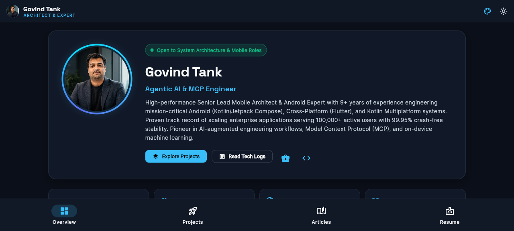

# 🚀 Govind Tank — Architectural Portfolio & Showcase v2

A high-performance, mobile-first responsive portfolio application engineered with **Flutter** (Impeller / CanvasKit natively) demonstrating advanced system architecture, Enterprise Mobile engineering, Agentic AI toolchains, and Kotlin Multiplatform capabilities.

---

## 🔗 Authoritative Live Links
* 🌐 **Main Engineering Website:** [govindtank.github.io](https://govindtank.github.io)
* 📱 **Live Web App:** [govindtank.github.io/portfolioApp/](https://govindtank.github.io/portfolioApp/)
* 📄 **Interactive Resume & CV:** [govindtank.github.io/resume/](https://govindtank.github.io/resume/)
* 🐙 **GitHub Profile:** [github.com/govindtank](https://github.com/govindtank)

---

## 📸 App Preview & Visual Vibe

The application showcases a fluid, high-tech **Cyber-Architect Design System** optimized across mobile phones, tablets, and desktop viewports.

### Dark Mode (Obsidian Cyber)


### Light Mode (Aurora Glass)


---

## ⚡ Key Highlights & Features

### 1. 🎮 Interactive GitHub Contribution Snake Matrix
A real-time contribution grid easter egg with an animated Cyber Snake that glides over contribution blocks.
- **Autonomous Auto-Pilot:** Watch the snake crawl through real GitHub contribution heatmaps.
- **Playable D-Pad Mode:** Take control and steer the snake to eat glowing commit blocks.
- Highlights 2,480+ contributions and 142-day active streaks.

### 2. 📝 110+ Dynamic Blogs from `govindtank.github.io`
Tech logs and deep dives are fetched live from the [`govindtank.github.io`](https://govindtank.github.io) repository:
- Filter categories: **Flutter & Impeller**, **Agentic AI & MCP**, **Android & KMP**, **System Design**, and **Dev Tools**.
- Dual reading modes: Native formatted Markdown with custom syntax-highlighted code blocks & direct web links.
- Instant search by keyword, tag, or topic.

### 3. 📄 Executive Resume Portal
A dedicated, professional CV tab with:
- 1-tap direct access to the live [Interactive Resume Portal](https://govindtank.github.io/resume/).
- Verified visitor count metrics and executive architectural summary.
- Comprehensive career progression timeline, technical toolchain competencies, and education background.

### 4. 📱 Mobile-First Responsive Polish
- All cards, metrics grids, toolchains, and badges use fluid responsive wrapping (`Wrap`, `FittedBox`, `Flexible`).
- No text overlaps or border overflows on small screens (down to 320px width).
- Ambient mesh backgrounds with floating Aurora orbs that adapt to your chosen neon accent theme.

---

## 🛠️ Build & Run Locally

```bash
# Get dependencies
flutter pub get

# Run with Flutter Web
flutter run -d chrome

# Build for GitHub Pages deployment
flutter build web --release --base-href /portfolioApp/
```

> **Lead Architect**: [Govind Tank](https://govindtank.github.io) — Senior Lead Mobile Architect & Android Expert.
